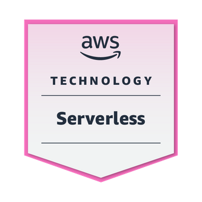
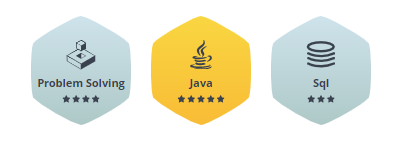

## Featured Open source projects

| Project name | Build | Code coverage | Sonarcloud code quality |
| ------------ | ----- | ------------- | ------------ |
| [give-my-secret](https://github.com/peter-szrnka/give-my-secret) |  |  |  |
| [firebase-hosting-api-java](https://github.com/peter-szrnka/firebase-hosting-api-java) |  |  |  |
| [rendertheme-color-viewer](https://github.com/peter-szrnka/rendertheme-color-viewer) |  |  |  |
| [cssjs-minifier](https://github.com/peter-szrnka/cssjs-minifier) |  |  |  |
| [mini-http-server](https://github.com/peter-szrnka/mini-http-server) |  |  |  |

## AWS Badges

AWS Learning:

AWS Educate: 

## HackerRank

