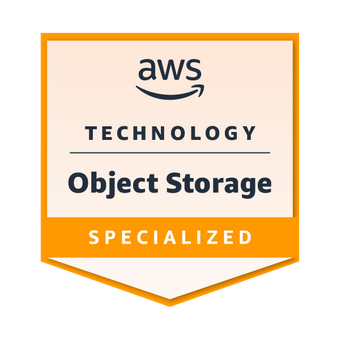

# Hi, I'm Peter!
Lead Java Software Engineer with 10+ years of experience in the software engineering industry.

## Currently used programming languages and tools

  
  
  
  
  
  
  
  
  
  
  
  

## Used programming languages &amp; tools in hobby projects

  
  
  
  
  
  
  
  
  
  
  
  
  
  
  

## GitHub

### Stats
<

### Featured Open source projects

| Project name | Build | Code coverage | Sonarcloud code quality |
| ------------ | ----- | ------------- | ------------ |
| [give-my-secret](https://github.com/peter-szrnka/give-my-secret) |  |  |  |
| [firebase-hosting-api-java](https://github.com/peter-szrnka/firebase-hosting-api-java) |  |  |  |
<!--| [rendertheme-color-viewer](https://github.com/peter-szrnka/rendertheme-color-viewer) |  |  |  |
| [cssjs-minifier](https://github.com/peter-szrnka/cssjs-minifier) |  |  |  |
| [mini-http-server](https://github.com/peter-szrnka/mini-http-server) |  |  |  |-->

## Training badges
### AWS

<!--

### Google Cloud

-->

### Observability

### Other

 

<!--
## HackerRank

-->
